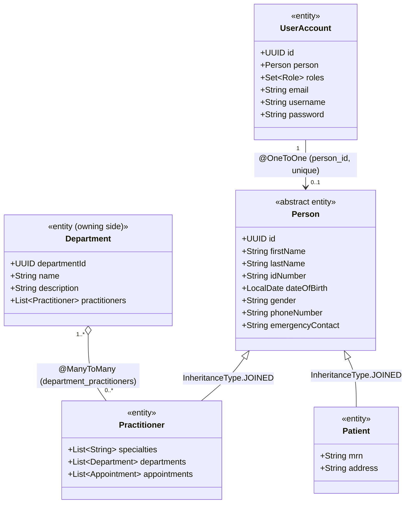
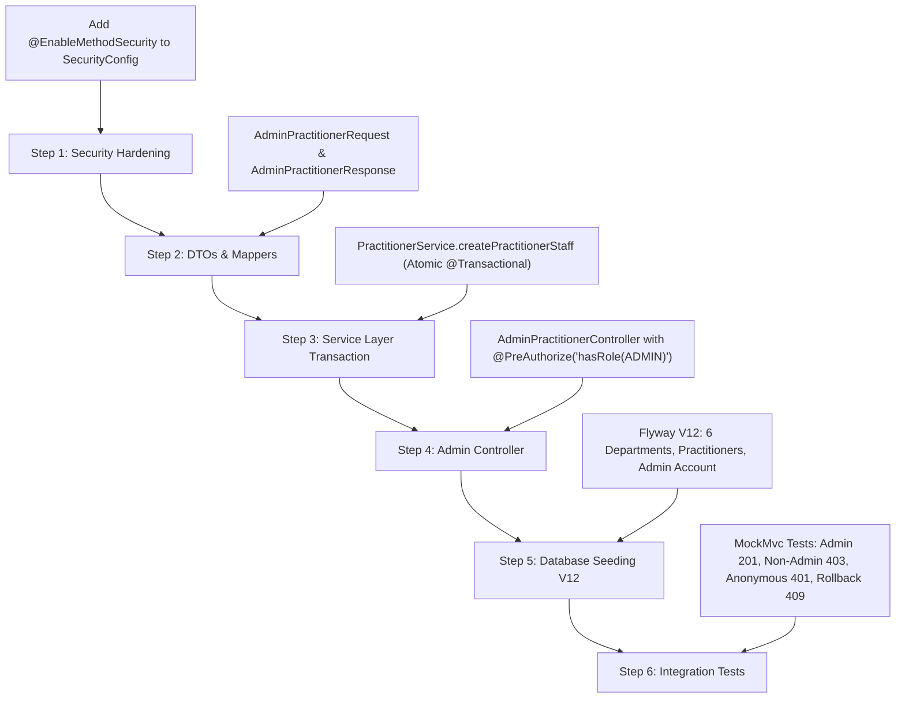

# Evaluation Report: Admin & Staff Onboarding & API Versioning

**Project:** Evergreen General Hospital API (`com.evergreen.generalhospital`)  
**Framework:** Spring Boot 4.1.1 / Spring Framework 7.0.9 (Java 21)  
**Target Requirement:** Phase D — Admin & Staff Onboarding (Items D.1 & D.2)  
**Date:** September 2026  

---

## 1. Executive Summary

This document evaluates the architectural requirements, design decisions, and implementation plan for **Phase D (Admin & Staff Onboarding)** of the Evergreen General Hospital system:

1. **D.1 — Practitioner & Staff Creation Endpoint:**  
   `POST /api/v1/admin/practitioners` (Secured with `@PreAuthorize("hasRole('ADMIN')")`).  
   Creates a `Practitioner` record, assigns `Department` and `Specialties`, and provisions their corresponding `UserAccount` with `ROLE_PRACTITIONER` in a single transactional operation.
2. **D.2 — Database Seeding:**  
   Provide Flyway migration or dev runner seeding realistic departments (*Cardiology, Dermatology, Neurology, Orthopedics, Pediatrics, General Medicine*), practitioners, and an initial administrative user.
3. **API Evolution & Versioning:**  
   Address legacy prototype endpoints ("endpoints created for the sake of existing") by evaluating native API versioning and deprecation features available in **Spring Boot 4 / Spring Framework 7**.

---

## 2. Domain & Knowledge Graph Analysis

Analysis of the codebase alongside [Graphify's Knowledge Graph](file:///home/aroon/Projects/hospital/api/graphify-out/GRAPH_REPORT.md) identified the primary bridge abstractions (God nodes) in the system:



### Relational Invariants & Constraints:
1. **Joined Inheritance (`persons` + `practitioners`):**  
   `Practitioner` extends `Person` using `InheritanceType.JOINED`. Persisting a practitioner must insert rows into both `persons` and `practitioners` linked by `person_id`.
2. **Owning Side of Many-to-Many (`department_practitioners`):**  
   `Department` is the owning side (`@JoinTable(name = "department_practitioners")`), while `Practitioner.departments` is mapped by `"practitioners"`. When affiliating a practitioner with departments, updating `department.getPractitioners().add(practitioner)` ensures persistence.
3. **One-to-One User Account Link:**  
   `UserAccount` holds a unique foreign key to `Person` (`person_id`). Because `Practitioner` is a `Person`, the user account connects directly to the practitioner instance (`userAccount.setPerson(practitioner)`).
4. **Validation Constraints:**  
   `@ValidUserAccountRoleLink` and `ValidUserAccountRoleLinkValidator` enforce that any account with `ROLE_PRACTITIONER` must have a non-null `Person` reference.

---

## 3. Existing Endpoints vs. Staff Onboarding Requirements

Several existing endpoints were developed early as simple CRUD placeholders:

| Existing Endpoint | Controller | Limitation / Issue |
| :--- | :--- | :--- |
| `POST /api/v1/practitioners` | `PractitionerController` | Creates an orphan practitioner with no login credentials (`UserAccount`) and no department affiliations. Doctors created here cannot log into the system. |
| `POST /api/v1/user-accounts` | `UserAccountController` | Annotated with *"Future feature: Administrative account creation"*. Requires pre-existing `patientId` or `practitionerId`, forcing an awkward multi-step onboarding process. |
| `GET /api/v1/demo` | `DemoController` | Pure initial scaffolding template. |

### Mission D.1 Solution:
Consolidate identity, clinical affiliations, and security access into `POST /api/v1/admin/practitioners`:
- Inputs: Demographics + Department IDs + Specialties + Account credentials.
- Execution: Single atomic database transaction (`@Transactional`).
- Output: Complete practitioner profile and non-sensitive user account metadata.

---

## 4. API Versioning in Spring Boot 4 / Spring Framework 7

The application runs **Spring Boot 4.1.1** over **Spring Framework 7.0.9**. Spring Framework 7 introduces **first-class native API Versioning** in Spring MVC:
- `org.springframework.web.accept.ApiVersionStrategy`
- `org.springframework.web.accept.PathApiVersionResolver`
- `org.springframework.web.accept.HeaderApiVersionResolver`
- `org.springframework.web.accept.StandardApiVersionDeprecationHandler`

### Versioning & Lifecycle Strategy:
1. **Namespace Separation (`/api/v1/admin/**`):**  
   Isolate administrative operations under `/admin` routes. This separates operational administrative tasks from public/patient contracts.
2. **Deprecation of Legacy CRUD Endpoints:**  
   Mark `POST /api/v1/practitioners` and `POST /api/v1/user-accounts` as `@Deprecated`. In Spring 7, `StandardApiVersionDeprecationHandler` can be leveraged to automatically emit RFC-compliant `Deprecation` and `Sunset` headers.
3. **Formal Version Transition (v1 → v2):**  
   When releasing v2 for smart scheduling/triage, Spring 7's `PathApiVersionResolver` or `HeaderApiVersionResolver` can be configured globally in `WebMvcConfigurer` to dynamically dispatch versioned requests without custom URL path regexes or servlet filter hacks.

---

## 5. Technical Design: D.1 Staff Onboarding Endpoint

### 5.1 Security Configuration Gap
In `SecurityConfig.java`, `@EnableMethodSecurity` is currently **missing**.
> **Critical Requirement:** Without `@EnableMethodSecurity` on `@Configuration`, Spring Security will silently ignore `@PreAuthorize("hasRole('ADMIN')")`.

Required changes in `SecurityConfig.java`:
```java
@Configuration
@EnableWebSecurity
@EnableMethodSecurity // <-- Required for @PreAuthorize
@ConfigurationProperties(prefix = "cors")
public class SecurityConfig {
    // ...
    // In filterChain:
    .authorizeHttpRequests(auth -> auth
        .requestMatchers("/api/v1/admin/**").hasRole("ADMIN") // Defense in depth
        .requestMatchers("/swagger-ui/**", "/api-docs/**", "/api/v1/login", "/api/v1/register").permitAll()
        .anyRequest().authenticated()
    )
}
```

### 5.2 Contract & DTOs

#### Request: `AdminPractitionerRequest`
```java
public record AdminPractitionerRequest(
    @NotBlank String firstName,
    @NotBlank String lastName,
    @NotBlank @Size(min = 10, max = 10) String idNumber,
    @NotNull @Past LocalDate dateOfBirth,
    @NotBlank String gender,
    @NotBlank @Size(min = 6, max = 20) String phoneNumber,
    @NotBlank String emergencyContact,
    @NotEmpty List<UUID> departmentIds,
    List<String> specialties,
    @NotBlank @Email String email,
    String username, // Optional: defaults to email if blank
    @NotBlank @Size(min = 6) String password
) {}
```

#### Response: `AdminPractitionerResponse`
```java
public record AdminPractitionerResponse(
    UUID practitionerId,
    String firstName,
    String lastName,
    String idNumber,
    LocalDate dateOfBirth,
    String gender,
    String phoneNumber,
    String emergencyContact,
    List<String> specialties,
    List<DepartmentSummaryResponse> departments,
    UserAccountSummaryResponse account,
    LocalDateTime createdAt
) {}
```

### 5.3 Service Layer Execution (`@Transactional`)
1. **Uniqueness Validation:**
   - Verify `practitionerRepository.existsByIdNumber(idNumber)` $\rightarrow$ throw `RepeatedIdNumberException` (409 Conflict).
   - Verify `userAccountRepository.existsByEmail(email)` and `existsByUsername(username)` $\rightarrow$ throw `RepeatedUsernameException` (409 Conflict).
2. **Department Resolution:**
   - Query `departmentRepository.findAllById(departmentIds)`. If any ID is missing, throw `ResourceNotFoundException` (404 Not Found).
3. **Entity Construction:**
   - Instantiate `Practitioner` with demographics and specialties.
   - For each resolved `Department`, add practitioner to `department.getPractitioners()` (owning side).
   - Persist `Practitioner` via `practitionerRepository.save(practitioner)`.
4. **User Account Provisioning:**
   - Instantiate `UserAccount` with `provider = "local"`, `providerSubject = username`, `roles = {Role.ROLE_PRACTITIONER}`.
   - Hash password using `passwordEncoder.encode(password)`.
   - Link entity: `userAccount.setPerson(practitioner)`.
   - Persist `UserAccount` via `userAccountRepository.save(userAccount)`.
5. **Return Unified DTO.** If any step fails, transaction rolls back completely.

---

## 6. Technical Design: D.2 Database Seeding

### 6.1 Required Seed Data
1. **6 Departments:**
   - Cardiology (*Heart and cardiovascular health*)
   - Dermatology (*Skin, hair, and nail conditions*)
   - Neurology (*Brain, spine, and nervous system disorders*)
   - Orthopedics (*Bones, joints, ligaments, and musculoskeletal care*)
   - Pediatrics (*Comprehensive medical care for infants, children, and adolescents*)
   - General Medicine (*Primary care, chronic disease management, and internal medicine*)
2. **Realistic Practitioners:**
   - Doctors assigned to departments with corresponding specialties (e.g. *Interventional Cardiology*, *Pediatric Surgery*, *Epileptology*, etc.).
3. **User Accounts:**
   - `ROLE_PRACTITIONER` accounts for each seeded doctor.
   - **Initial Admin Account:** An admin user (`admin@evergreen.com` with `ROLE_ADMIN`) must be seeded to enable authorized calls to the administrative API.

### 6.2 Implementation Strategy: Flyway Migration vs. Dev Runner

| Dimension | Flyway Migration (`V12__seed_departments_and_practitioners.sql`) | Spring Dev Runner (`@Profile("dev") CommandLineRunner`) |
| :--- | :--- | :--- |
| **Execution** | Automatic on database startup (PostgreSQL / Docker). | Bootstrapped by Spring when `dev` profile is active. |
| **Password Hashing** | Uses fixed, pre-computed BCrypt hashes. | Dynamically computes hashes via `PasswordEncoder`. |
| **Test Environment** | Tests disable Flyway (`spring.flyway.enabled=false`). | Excluded from test suite using `@Profile("dev")`. |
| **Idempotency** | Guarded with `ON CONFLICT DO NOTHING`. | Guarded with repository existence checks (`existsByName`). |

**Recommendation:**  
Use **Flyway `V12`** as the source of truth for base departments, reference practitioners, and initial admin credentials in persistent environments (Docker/Local Postgres), accompanied by an optional idempotent dev runner if programmatic seeding is preferred during rapid iteration.

---

## 7. Implementation & Verification Roadmap



### Verification Checklist:
- [ ] `POST /api/v1/admin/practitioners` with Admin JWT returns `201 Created` with full body and `Location` header.
- [ ] Calling with Patient or Practitioner token returns `403 Forbidden`.
- [ ] Calling unauthenticated returns `401 Unauthorized`.
- [ ] Duplicate `idNumber` or `email` returns `409 Conflict` and verifies no partial rows are committed.
- [ ] `./gradlew clean build test` passes with full test coverage.
