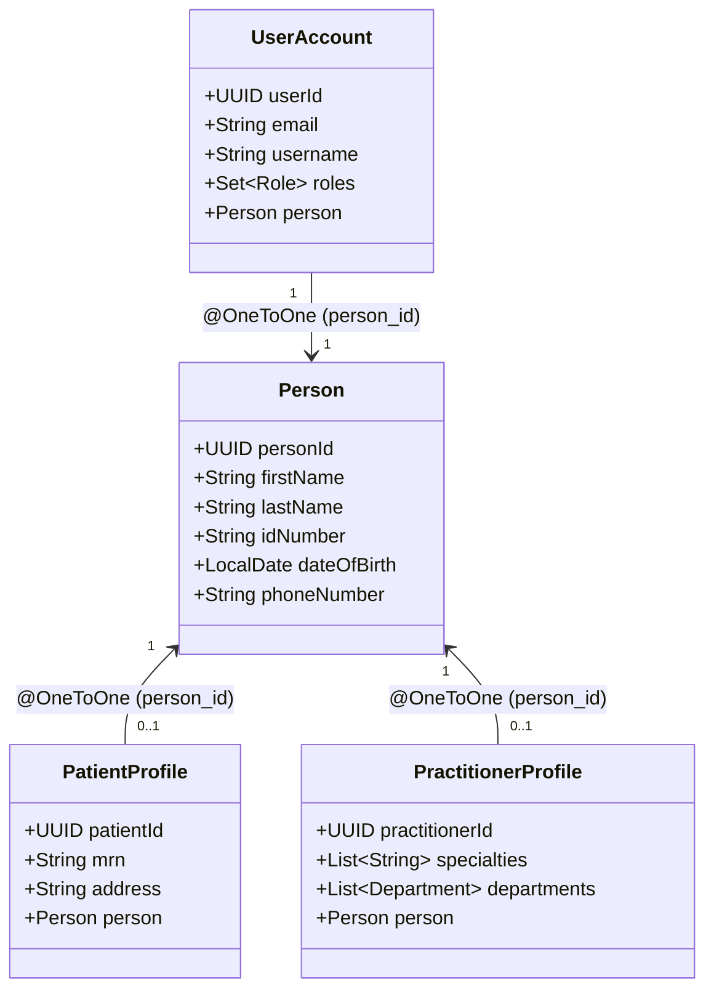

# Architecture Guide: Party-Role Composition Pattern for Evolving Identities

**Project:** Evergreen General Hospital API  
**Context:** Domain Model Evolution (Patient & Practitioner Identity Unification)  
**Reference Standards:** Martin Fowler's *Party-Role Archetype*, HL7 FHIR (*Patient*, *Practitioner*, *Person*)  

---

## 1. Context & Motivation

In early iterations of the system, joined-table inheritance (`InheritanceType.JOINED`) was used to model clinical actors:

```
        [Person] (abstract)
         ▲    ▲
 extends │    │ extends
         │    │
    [Patient] [Practitioner]
```

### The Invariant Limitation
While elegant for strictly distinct entities, class inheritance encodes an immutable **"IS-A"** relationship:
- In Java, an object instance cannot belong to more than one concrete class at runtime.
- If a registered patient later joins the hospital staff as a practitioner (or a physician receives care as a patient), joined inheritance forces either:
  1. Creating a duplicate `Person` record (violating real-world identity and `idNumber` uniqueness), or
  2. Overwriting foreign keys and orphaning the prior clinical history.

To support real-world lifecycle transitions, the architecture can evolve to the **Party-Role Composition Pattern** (**"HAS-A"**).

---

## 2. Architecture Comparison

### Current: Joined Inheritance (`extends`)
- `Person` is `abstract`.
- Tables: `persons`, `patients` (PK `patient_id` $\rightarrow$ `person_id`), `practitioners` (PK `practitioner_id` $\rightarrow$ `person_id`).
- Constraint: A single `person_id` cannot easily exist in both `patients` and `practitioners` while preserving clean JPA polymorphism.

### Proposed: Party-Role Composition (`associates`)
- `Person` is a **concrete entity** representing physical human identity (name, date of birth, national ID, demographics).
- `PatientProfile` and `PractitionerProfile` are role entities that link to `Person` via foreign key associations.
- A single `Person` can hold zero, one, or both profiles simultaneously over their lifetime.



---

## 3. Relational Schema Example (PostgreSQL)

```sql
-- 1. Base human identity
CREATE TABLE persons (
    person_id         UUID PRIMARY KEY DEFAULT gen_random_uuid(),
    first_name        VARCHAR(50)  NOT NULL,
    last_name         VARCHAR(50)  NOT NULL,
    id_number         VARCHAR(10)  NOT NULL UNIQUE,
    date_of_birth     DATE         NOT NULL,
    gender            VARCHAR(20),
    phone_number      VARCHAR(20)  NOT NULL,
    emergency_contact VARCHAR(200) NOT NULL,
    created_at        TIMESTAMP    NOT NULL DEFAULT NOW(),
    updated_at        TIMESTAMP    NOT NULL DEFAULT NOW()
);

-- 2. Patient Role Profile (clinical care receiver)
CREATE TABLE patients (
    patient_id  UUID PRIMARY KEY DEFAULT gen_random_uuid(),
    person_id   UUID NOT NULL UNIQUE REFERENCES persons(person_id) ON DELETE CASCADE,
    mrn         VARCHAR(50) NOT NULL UNIQUE,
    address     VARCHAR(200) NOT NULL,
    created_at  TIMESTAMP NOT NULL DEFAULT NOW(),
    updated_at  TIMESTAMP NOT NULL DEFAULT NOW()
);

-- 3. Practitioner Role Profile (clinical care provider)
CREATE TABLE practitioners (
    practitioner_id UUID PRIMARY KEY DEFAULT gen_random_uuid(),
    person_id       UUID NOT NULL UNIQUE REFERENCES persons(person_id) ON DELETE CASCADE,
    created_at      TIMESTAMP NOT NULL DEFAULT NOW(),
    updated_at      TIMESTAMP NOT NULL DEFAULT NOW()
);

-- 4. User login credentials linked to the physical Person
CREATE TABLE user_accounts (
    user_id          UUID PRIMARY KEY DEFAULT gen_random_uuid(),
    person_id        UUID NOT NULL UNIQUE REFERENCES persons(person_id) ON DELETE CASCADE,
    email            VARCHAR(200) NOT NULL UNIQUE,
    username         VARCHAR(50)  NOT NULL UNIQUE,
    password_hash    VARCHAR(255) NOT NULL,
    created_at       TIMESTAMP    NOT NULL DEFAULT NOW(),
    updated_at       TIMESTAMP    NOT NULL DEFAULT NOW()
);
```

---

## 4. JPA Implementation Example

### 4.1 Concrete `Person` Entity
```java
@Entity
@Table(name = "persons")
public class Person {
    @Id
    @GeneratedValue(strategy = GenerationType.UUID)
    @Column(name = "person_id")
    private UUID personId;

    @Column(name = "first_name", nullable = false, length = 50)
    private String firstName;

    @Column(name = "last_name", nullable = false, length = 50)
    private String lastName;

    @Column(name = "id_number", nullable = false, unique = true, length = 10)
    private String idNumber;

    @Column(name = "date_of_birth", nullable = false)
    private LocalDate dateOfBirth;

    @Column(name = "gender", length = 20)
    private String gender;

    @Column(name = "phone_number", nullable = false, length = 20)
    private String phoneNumber;

    @Column(name = "emergency_contact", nullable = false, length = 200)
    private String emergencyContact;

    @OneToOne(mappedBy = "person", cascade = CascadeType.ALL, fetch = FetchType.LAZY)
    private Patient patientProfile;

    @OneToOne(mappedBy = "person", cascade = CascadeType.ALL, fetch = FetchType.LAZY)
    private Practitioner practitionerProfile;

    // Helper queries
    public boolean isPatient() {
        return patientProfile != null;
    }

    public boolean isPractitioner() {
        return practitionerProfile != null;
    }
}
```

### 4.2 Role Profile: `Patient`
```java
@Entity
@Table(name = "patients")
public class Patient {
    @Id
    @GeneratedValue(strategy = GenerationType.UUID)
    @Column(name = "patient_id")
    private UUID patientId;

    @OneToOne(fetch = FetchType.LAZY, optional = false)
    @JoinColumn(name = "person_id", nullable = false, unique = true)
    private Person person;

    @Column(name = "mrn", nullable = false, unique = true, length = 50)
    private String mrn;

    @Column(name = "address", nullable = false, length = 200)
    private String address;

    @OneToMany(mappedBy = "patient")
    private List<Appointment> appointments = new ArrayList<>();
}
```

### 4.3 Role Profile: `Practitioner`
```java
@Entity
@Table(name = "practitioners")
public class Practitioner {
    @Id
    @GeneratedValue(strategy = GenerationType.UUID)
    @Column(name = "practitioner_id")
    private UUID practitionerId;

    @OneToOne(fetch = FetchType.LAZY, optional = false)
    @JoinColumn(name = "person_id", nullable = false, unique = true)
    private Person person;

    @ElementCollection
    @CollectionTable(name = "practitioner_specialties", joinColumns = @JoinColumn(name = "practitioner_id"))
    @Column(name = "specialty", length = 100)
    private List<String> specialties = new ArrayList<>();

    @ManyToMany(mappedBy = "practitioners")
    private List<Department> departments = new ArrayList<>();

    @OneToMany(mappedBy = "practitioner")
    private List<Appointment> appointments = new ArrayList<>();
}
```

---

## 5. Service Layer: Role Promotion Flow

Under composition, adding practitioner capabilities to an existing patient account is straightforward and does not require touching existing medical records or generating new identities:

```java
@Service
@Transactional
public class StaffOnboardingService {

    private final PersonRepository personRepository;
    private final PractitionerRepository practitionerRepository;
    private final UserAccountRepository userAccountRepository;
    private final DepartmentRepository departmentRepository;

    public Practitioner promoteOrOnboardPractitioner(AdminPractitionerRequest req) {
        // 1. Resolve or create Person by unique national ID
        Person person = personRepository.findByIdNumber(req.idNumber())
            .orElseGet(() -> createNewPerson(req));

        // 2. Prevent duplicate role assignment
        if (practitionerRepository.existsByPerson(person)) {
            throw new RepeatedIdNumberException("Practitioner role already exists for this person");
        }

        // 3. Resolve clinical affiliations
        List<Department> departments = departmentRepository.findAllById(req.departmentIds());

        // 4. Attach Practitioner Role to Person
        Practitioner practitioner = new Practitioner();
        practitioner.setPerson(person);
        practitioner.setSpecialties(req.specialties());
        practitionerRepository.save(practitioner);

        for (Department dept : departments) {
            dept.getPractitioners().add(practitioner);
            practitioner.getDepartments().add(dept);
        }

        // 5. Update or provision UserAccount
        UserAccount account = userAccountRepository.findByPerson(person)
            .orElseGet(() -> createNewAccount(person, req));

        account.getRoles().add(Role.ROLE_PRACTITIONER);
        userAccountRepository.save(account);

        return practitioner;
    }
}
```

---

## 6. Migration Roadmap from Current Model

| Step | Action | Impact |
| :--- | :--- | :--- |
| **Phase 1** | Keep existing joined inheritance while Phase D requirements (admin staff onboarding) are delivered. | Zero breaking changes to existing endpoints. |
| **Phase 2** | Refactor JPA entities from `extends Person` to `@OneToOne Person person`. | Isolates clinical attributes (`mrn`, `specialties`) to role entities while retaining database tables. |
| **Phase 3** | Update endpoints (`/api/v1/patients/me`, `/api/v1/admin/practitioners`) to navigate `user.getPerson().getPatientProfile()` or `user.getPerson().getPractitionerProfile()`. | Enables unified single sign-on across roles. |
